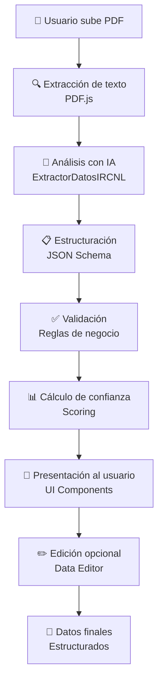

# 🏗️ Arquitectura del Sistema - GoogleGemini.Agent.CatstralAI

## 🎯 Visión General

GoogleGemini.Agent.CatstralAI es un sistema inteligente para el procesamiento automatizado de documentos catastrales mexicanos. Utiliza técnicas de IA para extraer, validar y estructurar información crítica de documentos PDF del registro de la propiedad.

## 🔧 Arquitectura del Sistema

### 📊 Diagrama de Componentes

```
┌─────────────────────────────────────────────────────────────┐
│                    FRONTEND (Next.js)                       │
├─────────────────────────────────────────────────────────────┤
│  📱 Interfaz de Usuario                                     │
│  ├── File Upload Area (Carga de archivos)                  │
│  ├── Process Flow Bar (Barra de progreso)                  │
│  ├── Data Editor Modal (Editor de datos)                   │
│  └── Data Visualization (Visualización)                    │
└─────────────────────────────────────────────────────────────┘
                                │
                                ▼
┌─────────────────────────────────────────────────────────────┐
│                 CAPA DE PROCESAMIENTO                       │
├─────────────────────────────────────────────────────────────┤
│  🔄 Server Actions (Next.js)                               │
│  ├── extract-from-pdf.ts (Extracción de texto)            │
│  ├── extract.ts (Procesamiento con IA)                    │
│  └── save-data.ts (Persistencia)                          │
└─────────────────────────────────────────────────────────────┘
                                │
                                ▼
┌─────────────────────────────────────────────────────────────┐
│                   MOTOR DE IA                               │
├─────────────────────────────────────────────────────────────┤
│  🤖 ExtractorDatosIRCNL                                    │
│  ├── OpenAI GPT-4 Integration                             │
│  ├── Prompt Engineering Especializado                      │
│  ├── JSON Schema Validation                               │
│  └── Confidence Scoring                                    │
└─────────────────────────────────────────────────────────────┘
                                │
                                ▼
┌─────────────────────────────────────────────────────────────┐
│                SISTEMA DE VALIDACIÓN                        │
├─────────────────────────────────────────────────────────────┤
│  ✅ Validadores Especializados                             │
│  ├── CURP Validator                                       │
│  ├── Expediente Catastral Validator                       │
│  ├── Fecha Validator                                      │
│  └── Superficie Validator                                 │
└─────────────────────────────────────────────────────────────┘
```

## 🏗️ Arquitectura por Capas

### 1. **Capa de Presentación** (Frontend)
- **Tecnología**: Next.js 15 + React 19 + TypeScript
- **Responsabilidades**:
  - Interfaz de usuario responsiva
  - Carga de archivos PDF
  - Visualización de datos extraídos
  - Edición y validación en tiempo real
  - Gestión de estado de la aplicación

### 2. **Capa de Lógica de Negocio** (Server Actions)
- **Tecnología**: Next.js Server Actions
- **Responsabilidades**:
  - Procesamiento de archivos PDF
  - Orquestación del flujo de extracción
  - Manejo de errores y estado
  - Comunicación con servicios externos

### 3. **Capa de Inteligencia Artificial**
- **Tecnología**: OpenAI GPT-4 + @ai-sdk
- **Responsabilidades**:
  - Extracción inteligente de datos
  - Interpretación de documentos catastrales
  - Análisis de confianza por campo
  - Estructuración de información

### 4. **Capa de Validación y Calidad**
- **Tecnología**: Validadores TypeScript + Zod
- **Responsabilidades**:
  - Validación de formatos específicos
  - Control de calidad de datos
  - Scoring de confianza
  - Detección de errores

## 🔄 Flujo de Procesamiento

### Proceso Principal de Extracción



### Detalle del Flujo Técnico

1. **Carga de Archivo** (`file-upload-area.tsx`)
   - Validación de tipo MIME
   - Control de tamaño de archivo
   - Estado de progreso visual

2. **Extracción de Texto** (`extract-from-pdf.ts`)
   - Utiliza PDF.js para parsing
   - Extracción completa del contenido textual
   - Manejo de errores de formato

3. **Procesamiento con IA** (`extractorDatos.ts`)
   - Prompt especializado para documentos catastrales
   - Llamada a OpenAI GPT-4
   - Parsing y validación de respuesta JSON

4. **Validación de Datos** (`utils/validation.ts`)
   - Validaciones específicas por tipo de campo
   - Cálculo de scores de confianza
   - Generación de mensajes de error

5. **Presentación de Resultados** (`data-card.tsx`)
   - Visualización estructurada
   - Indicadores de confianza
   - Opciones de edición

## 📦 Estructura de Datos

### Entidades Principales

```typescript
// Estructura principal de datos extraídos
interface ExtractedDataAI {
  informacion_predio: PredioInfo;        // Datos del predio
  medidas_colindancias: MedidasColindancias; // Medidas y colindancias
  titulares: TitularesInfo;              // Información de titulares
  acto_juridico: ActoJuridicoInfo;       // Detalles del acto jurídico
  datos_registrales: DatosRegistrales;   // Información registral
  antecedentes: Antecedentes;            // Antecedentes registrales
  extractionQuality: ExtractionQualityData; // Métricas de calidad
}
```

### Sistema de Confianza

Cada campo extraído incluye:
- **Valor extraído**: El dato identificado por la IA
- **Confidence score**: Puntuación de confianza (0-100)
- **Validación**: Estado de validación del campo
- **Mensaje de error**: Descripción específica de problemas

## 🛡️ Seguridad y Validación

### Validaciones Implementadas

1. **CURP**: Formato y dígito verificador
2. **Expediente Catastral**: Estructura específica
3. **Fechas**: Formatos válidos y coherencia temporal
4. **Superficie**: Valores numéricos y unidades

### Medidas de Seguridad

- Validación de tipos de archivo
- Sanitización de entrada de datos
- Manejo seguro de claves API
- Validación de esquemas JSON

## 🔧 Configuración y Extensibilidad

### Variables de Configuración (`lib/config.ts`)

- **USE_MOCK_DATA**: Modo de desarrollo con datos simulados
- **OPENAI_API_KEY**: Clave para el servicio de OpenAI
- **Límites de procesamiento**: Tamaños máximos y timeouts

### Puntos de Extensión

1. **Nuevos tipos de documento**: Extensión del enum `DocumentType`
2. **Validadores adicionales**: Implementación de nuevas reglas
3. **Modelos de IA alternativos**: Intercambio del proveedor de IA
4. **Formatos de exportación**: Nuevos formatos de salida

## 📈 Métricas y Monitoreo

### Indicadores de Calidad

- **Tasa de extracción exitosa**: % de documentos procesados correctamente
- **Confianza promedio**: Score medio de confianza por campo
- **Campos extraídos vs. total**: Cobertura de extracción
- **Tiempo de procesamiento**: Latencia del pipeline completo

### Logging y Debugging

- Logs detallados en cada etapa del proceso
- Preservación de texto original para debugging
- Timestamps para análisis de rendimiento
- Manejo granular de errores por componente

## 🚀 Optimizaciones y Rendimiento

### Estrategias de Optimización

1. **Lazy Loading**: Carga diferida de componentes pesados
2. **Memoización**: Cache de resultados de validación
3. **Streaming**: Procesamiento en tiempo real de archivos grandes
4. **Batch Processing**: Procesamiento por lotes para múltiples archivos

### Escalabilidad

- Arquitectura stateless para horizontal scaling
- Separación clara de responsabilidades
- APIs diseñadas para microservicios
- Caching strategies para respuestas frecuentes

---

*Esta arquitectura está diseñada para ser mantenible, escalable y extensible, permitiendo futuras mejoras y adaptaciones a nuevos requerimientos del dominio catastral.*